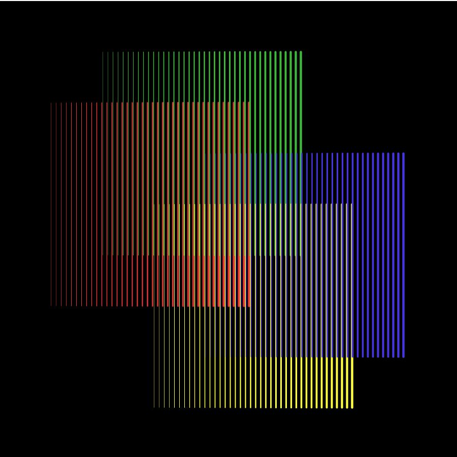

**July 13: Homework**

*Generative Artwork, medium: loops*

As a native Venezuelan, I have always been exposed to [Carlos Cruz-Diez](https://www.cruzdiezartfoundation.org/carlos-cruz-diez)'s artwork. It has hung on my [walls](https://lh3.googleusercontent.com/proxy/q7eBP8AJwIUHZ0j7gJ3oB38KEu3Ppv_hC66VyTQng2rWOSzTAdstykNzsKe6cPVDnsYl-CMB7h1XR-UDipGm3NjSySZOiIesi2p9tzKfAW0T8vEmC8k8Zhzvqmx4VIZCWUw0d-q3GCxBUuFc), been showcased in [museums](https://i.pinimg.com/originals/e3/39/cf/e339cf0da73816111c6c9835863cff4a.jpg) and along [highways](https://a4.pbase.com/o6/23/943723/1/141028553.GtYhDjFy.CarlosCruzDiezArtpiece-Caracas.jpg), and decorates the [airport](https://i.pinimg.com/originals/29/d7/b4/29d7b4bf2d5b35f17420abcd3a42ab73.jpg) of my city. When I travel, I see his influence in the [pedestrian crossing](https://s3.amazonaws.com/files.collageplatform.com.prod/image_cache/1010x580_fit/5ab12bb7a09a72340a8b4568/18b6026228e0ec20742a0a1517b13f76.jpg) design of Miami's streets and in countless museums internationally from [London to Paris to New York](https://www.rukajgallery.com/carlos-cruzdiez). His incredible dizzyingly abstract work, which consists of rigid lines of color that swirl into one another, inspired me to create my generative work of art.

My artwork consists of 4 while() loops, each which describes a 400x400 implied square composed of a series of repeated lines. Each one of these lines have varying widths as the first line is 0.1 thinner than the following line and so on. They additionally are of different colors, as each implied square is of either red, green, blue, or yellow color. The squares are floating on a black background and are slightly superimposed against another, resulting in the overlaying of different lines of different colors.

I began this by defining four variables which would represent the x coordinates of the vertical lines of each implied square. They differ by 101 in order to allow for a controlled superimposition of the lines. I next created other four variables which would represent the initial weights of each of the first line of each of the implied squares. Afterwards, I set up the canvas size and the background under the void setup() section of code. After closing this section, I began to create my while() loops under void draw(). The loops began by defining that while the x coordinate of the implied square in question was less than 400 units larger than the initial x coordinate, the lines would be of a specific stroke, augment in width by 0.1, and have a set of y coordinates. I repeated this four times, one for each implied square.

While creating my artwork, I began experimenting with the differences between an if() loop and a while() loop in order to decide which would be best for me. I also considered transformations but ended up using the while() loop as it allowed me to embedd several variations of the lines I wanted to draw within one function. Embedding these variations was a different challenge as the order of operations was significant. In addition, the amounts by which the strokeWeight would increase and by which the lines would be separated was also something I had to experiment for a while. However, once I got the first implied square drawn correctly, I only had to adjust a few things for the other three.

Something interesting I discovered while doing the assignment is that if I don't put the background color under void setup(), the background will be drawn again for every loop. I also discovered how to set the stroke color using the # instead of rgb values. The most valuable discovery was that I would create multiple edits to my lines within one while() loop function.

