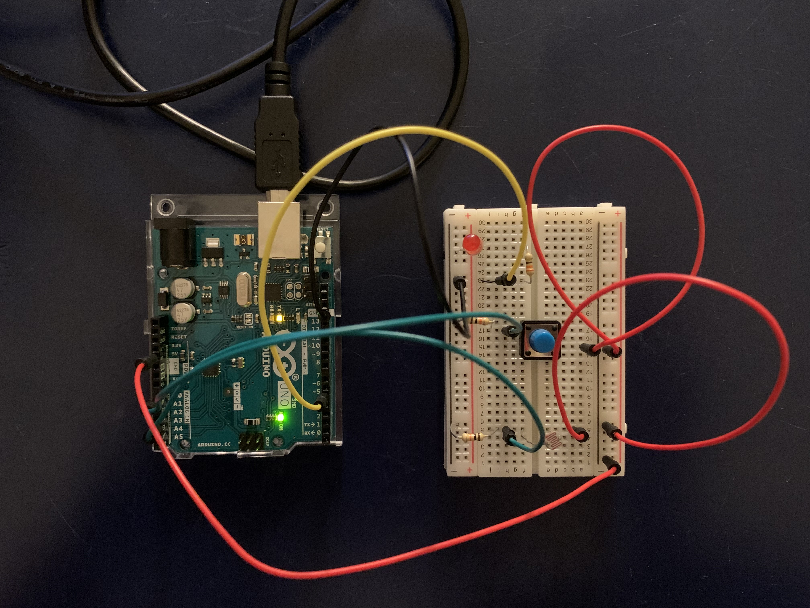

**July 22: Homework**

*A photoresistor, a switch, and two LEDs*

My circuit consists of:

a: a switch connected to the built-in LED light of Arduino

b: a light sensor which is <200 turns on an attached LED light

I had issues with the light sensor but then realized it was because I hadden't added the Serial.begin(9600) in void(setup).

Below are an image and a video that demonstrate how this works.

