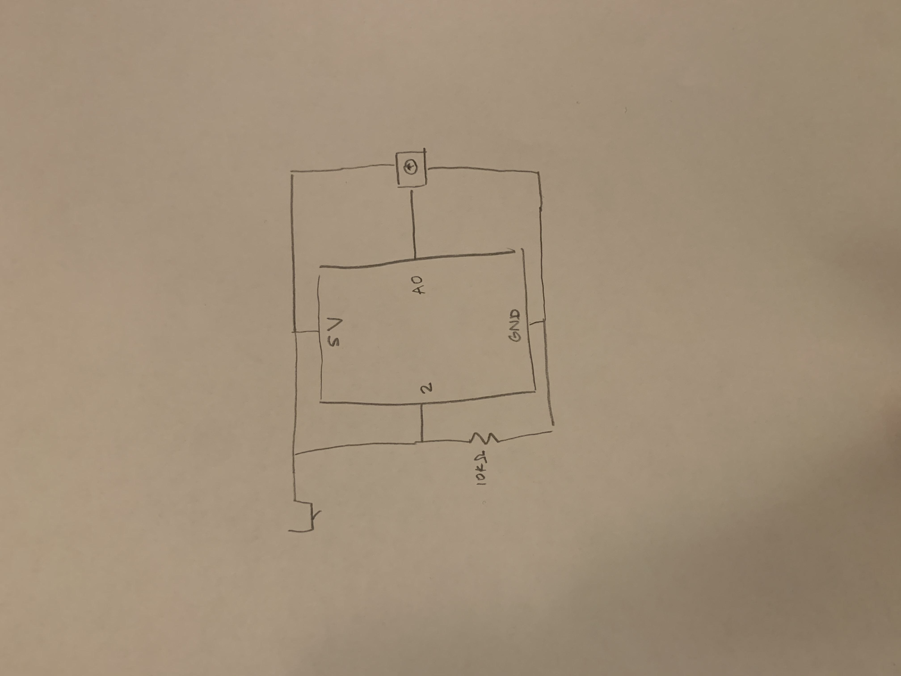
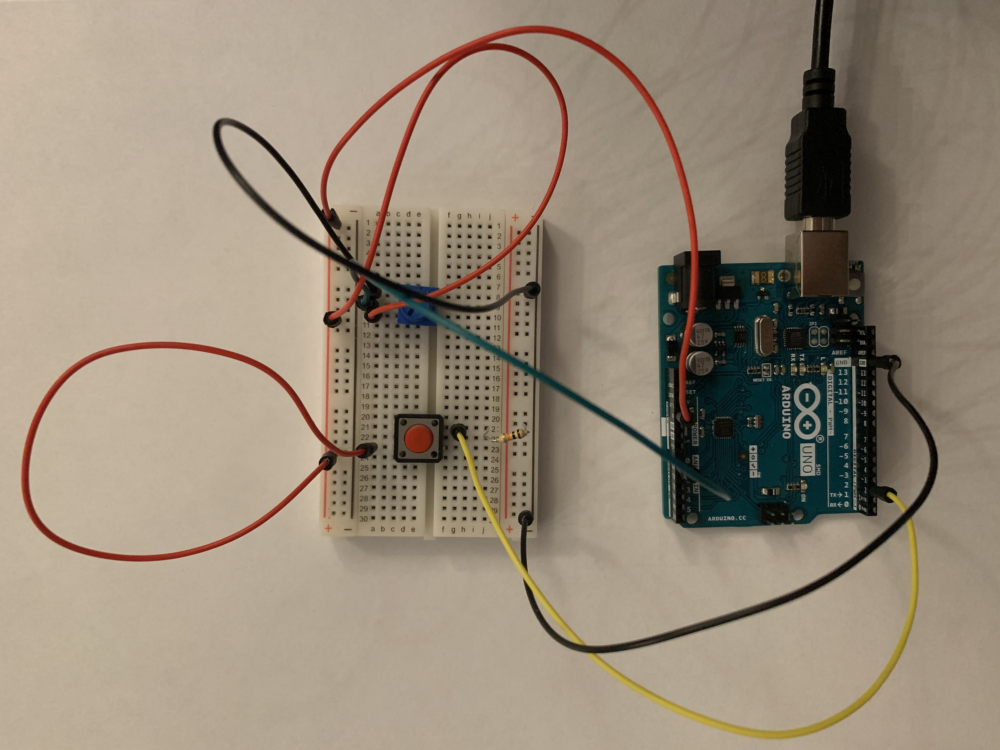
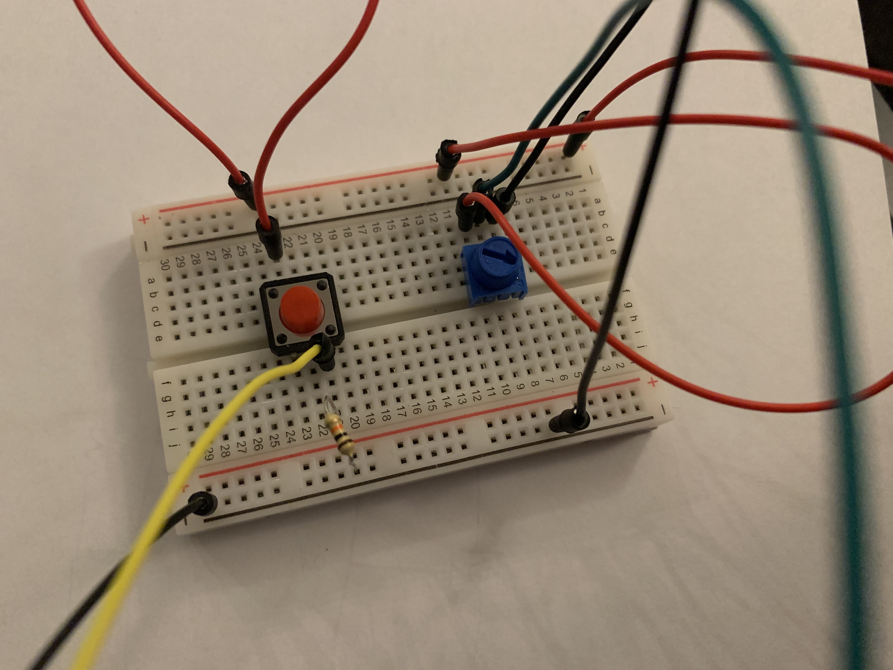
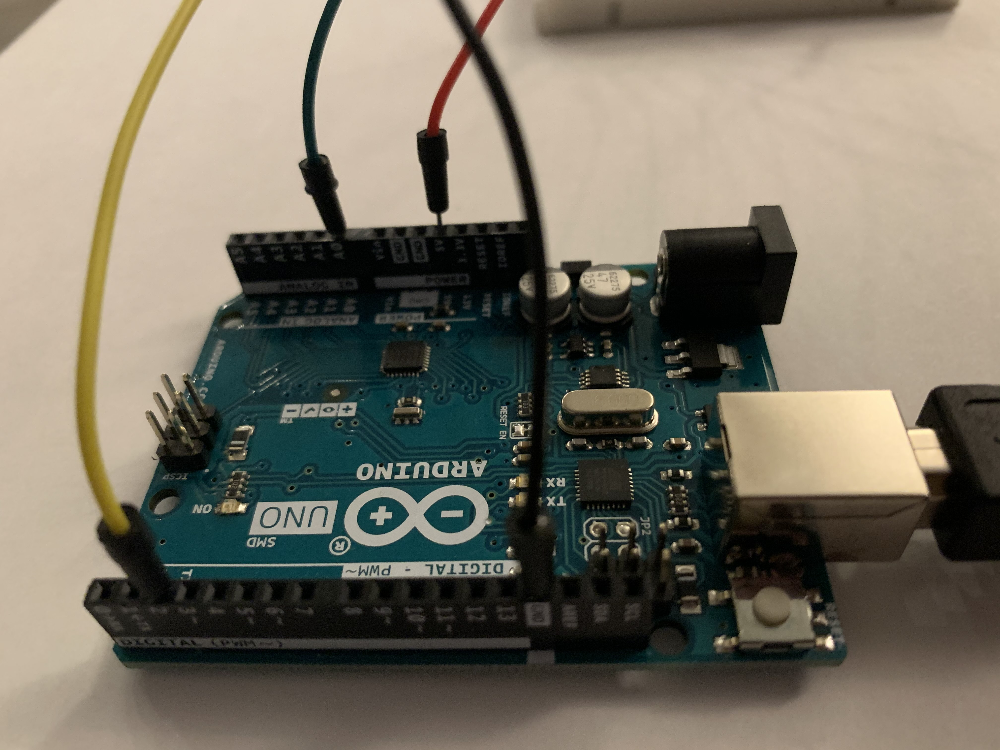

**July 29: Homework**

*Midterm Update: Processing and Arduino Communication*

The game is based on the player moving a paddle in the x direction using the potentiometer in order to bounce a ball. If the ball doesn't bounce on the paddle, the game is lost and over. However, if the player wants to end and restart the game at any moment, the player can choose to press the red button and the game will restart.

I wanted to incorporate the switch in order to restart the game but since it doesn't work like mousePressed(), I had to add an if statement within the if statement that checked if the sensor values were printed. This added if statement checks to see if sensor[1], which is my switch, is >= 255, which is the value it outputs when the switch is pressed. So if the switch is pressed, the reset() command is outputted, which I had previously created to redraw the ball in its original position and reset the score.

When attepting to connect the sensors in arduino to processing, I initially didn't get any values in the Serial Monitor. However, I closed all my tabs and rewired the arduino to the breadboard and when I reopened processing and arduino and ran them, I had no issues.

Here is a schematic demonstrating how the instrument works.

Here is a photograph of the instrument.

Here are closeup photographs of the electronics.

