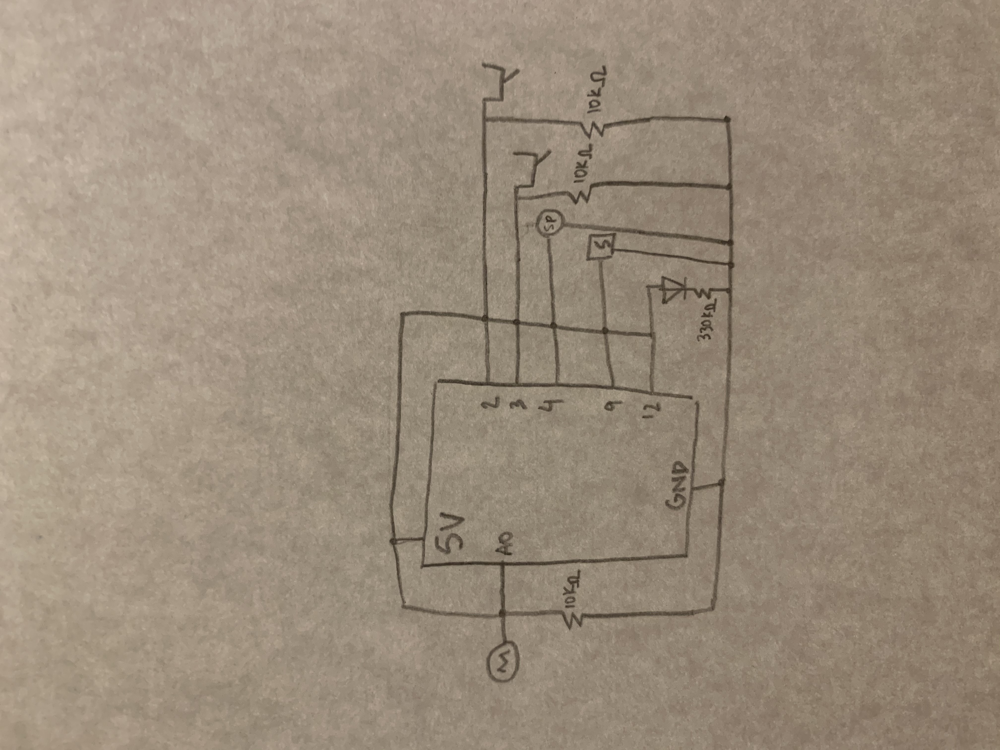
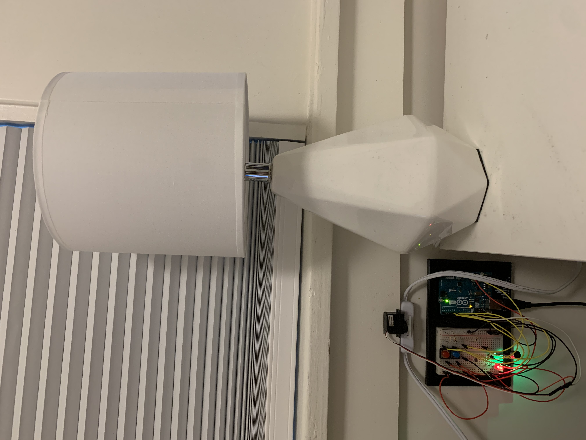
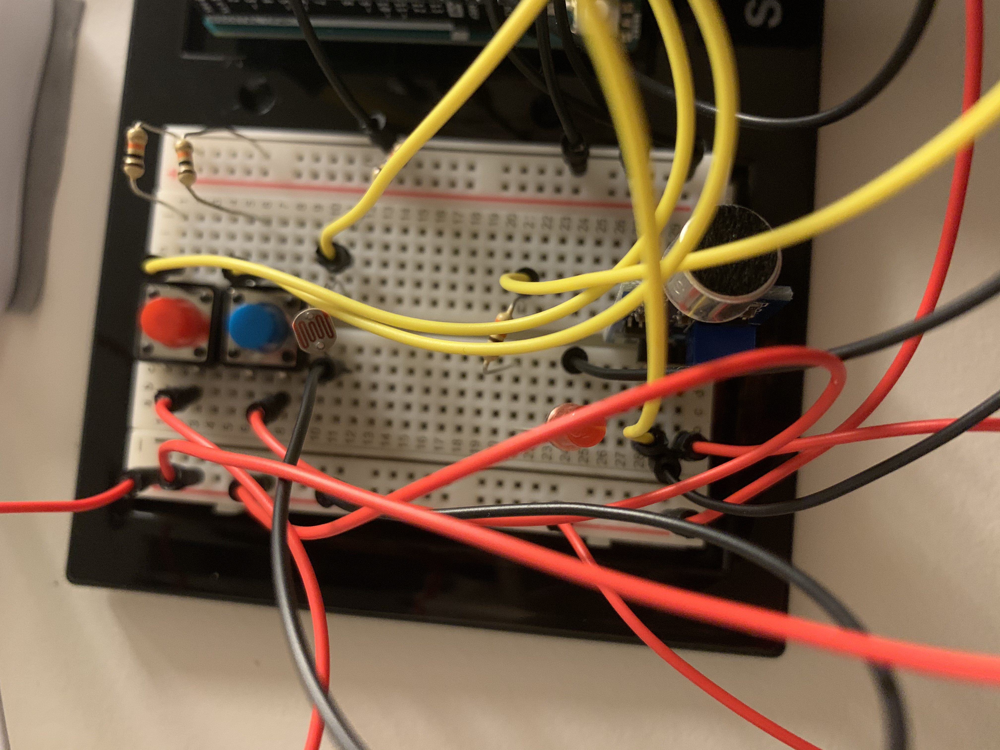
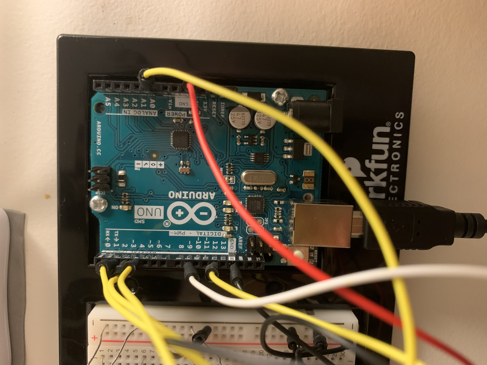

**August 14**

*Final Project*

My project is a sound automated night light. It uses a sound sensor to detect noise as well as a photoresistor which determines if the lamp should be turned on or off.
If it is dark and there is a sound detected, the lamp will be turned on. If it is bright, the lamp won’t be turned on. This prevents the lamp from being turned on unintentionally.
I also added buttons to allow the light to be controlled manually.
The sound and brightness sensors signal the servo motor, which is attached over the lamp's switch. When the servo rotates to the right, the lamp is turned on and when
it rotates to the righ, the lamp is turned off.

One of the greatest challenges of this project were to adjust the sound sensor's potentiometer, which adjusts the sensitivity of the sensor. If I rotated the potentiometer too
much to the right, sounds were hardly sensed but if I rotated it to much to the left, all sound were sensed and the servo turned the light on and off repeatedly and didn't stop.
The midpoint was hard to locate.

A second challenge was using the servo motor to control the lamp switch. Since the motor isn't very powerful, I had to attach it to the wall and over the lamp switch for it
to make contact with the switch. The degrees of rotation of the servo were an added challenge since too much rotation would damage the servo and too little rotation didn't
result in enough force to turn the switch on or off.

[Link](https://youtu.be/7163UvRmcfg) to the video presenting my project

